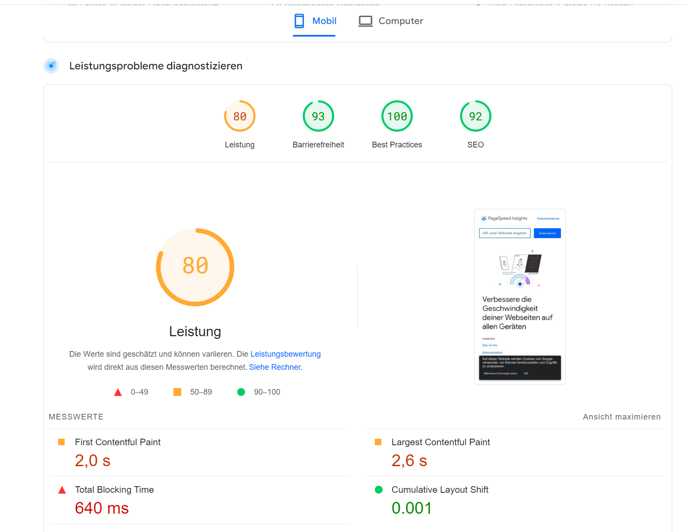
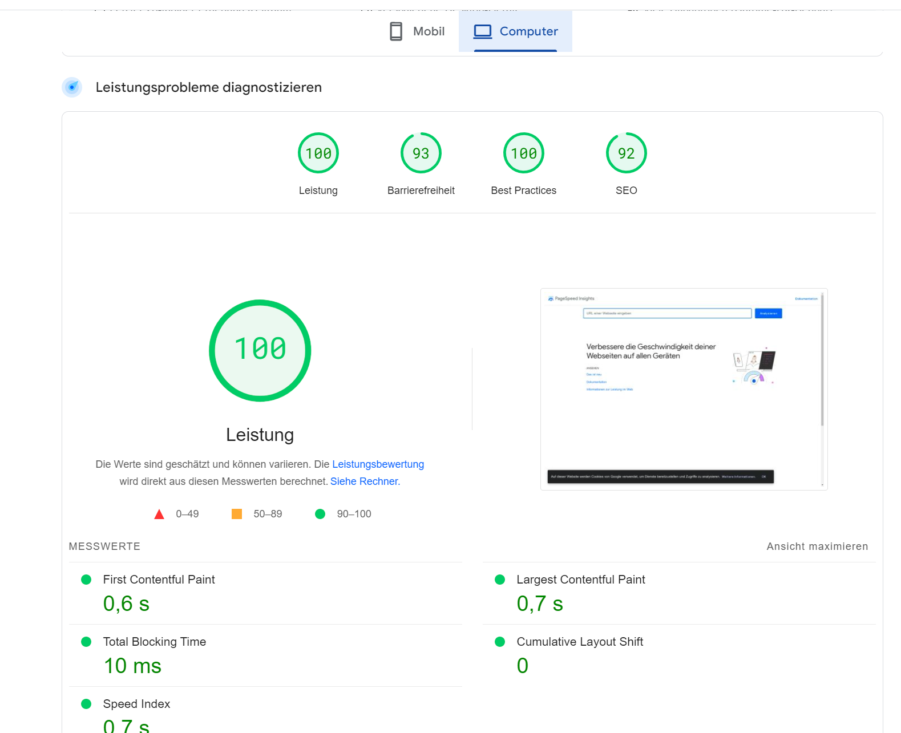

# Umsetzung validieren und verbessern

## Ausgangslage

- Ich habe zwar schon mehrere kleinere Webseiten erstellt, jedoch habe ich mich noch nie richtig mit der validierung dieser Webseite auseinander gesetzt.

- Meta Tags waren mir vor diesem Modul/Kompetenzbereich schon bekannt, jedoch habe ich sie noch nie verwendet.

- Syntax validierungsmethoden waren mir schon bekannt, da ich schon programme wie Prettier vor diesem Modul/Kompetenzbereich verwendet habe.

## Kompetenz E8

Ich kann diese Kompetenz damit beweisen, dass ich meine Webseite durch verschiedenste Programme und Tools habe testen lassen. Bei Google Lighthouse hat meine Webseite folgenden Score:


Dieses Ergebnis konnte ich damit erreichen, dass ich passende Bildformate verwendet habe. Ausserdem habe ich die Medien sinnvoll eingesetzt, sodass Sie die Geschwindigkeit der Webseite nicht beeinträchtigt wird.

Andererseits habe ich meine Webseite mit https://pagespeed.web.dev/?hl=DE nochmals überprüft, folgende Resultate kamen heraus:

Auf Mobilen Geräten so:


Auf dem Desktop so:



Um meine Webseite für die Suchmaschine zu optimieren (SEO) habe ich verschiedenste Meta Tags verwendet. Diese sehen so aus:
```
<meta name="description" content="Das Modul 293 besteht daraus eine eigene Webseite zu bauen. Die Webseite sollte visuell sehr ansprechend sein und ein responsives Design haben.">
  <meta name="title" content="Eine Webseite über das Modul 293!">
  <meta name="viewport" content="width=device-width, initial-scale=1.0">
  <meta name="keywords" content="Projekt, it projektmanagement">
  <title>Projekt Modul 293</title>
```

## Was kann man gegen einen schlechten Score in Lighthouse machen?

- Bilder Komprimieren mit Tools wie ImageOptim oder TinyPNG.
- Moderne Bildformate verwenden (WebP, AVIF)
- Semantische HTML-Tags verwenden und nicht nur DIV's (footer, header, main etc.)
- Sicherstellen, dass die Webseite über HTTPS bereitgestelt wird.

## Selbsteinschätzung

Ich finde, ich habe auch in diesem Kompetenzbereich die E-Kompetenz erreicht, da ich einen sehr guten Score auf Desktop Geräten habe. Mein Score auf Mobilen Geräten ist leider nicht so gut, wie dieser auf dem Desktop. Dies liegt sehr wahrscheinlich daran, dass ich am Anfang dieses Projektes nicht genau gewusst habe, welchen Ansatz ich verwenden sollte, um die Webseite zu bauen. Ich habe mich dann fälschlicherweise für einen Desktop-first Ansatz entschieden, was nicht die beste Idee war. Ich musste im nachhineien sehr lange daran herumbasteln, meine Webseite auf Mobilen Geräten responsive zu designen. Ich lerne daraus: Nur bei ausnahmefällen einen Desktop-First Ansatz bevorzugen. Dazu muss ich aber noch ergänzen, dass ich nicht so viel Zeit hatte, um meine Webseite komplett anzupassen für die Performance. In Zukunft muss ich mir für die optimierung etwas mehr Zeit einplanen. 