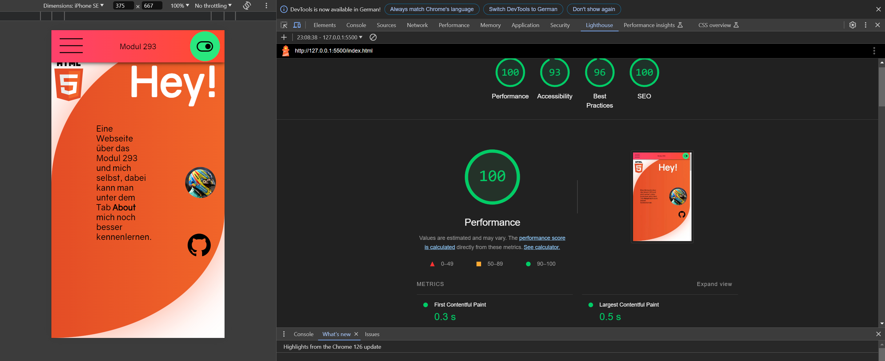

# Umsetzung validieren und verbessern

## Ausgangslage

- Ich habe zwar schon mehrere kleinere Webseiten erstellt, jedoch habe ich mich noch nie richtig mit der validierung dieser Webseite auseinander gesetzt.

- Meta Tags waren mir vor diesem Modul/Kompetenzbereich schon bekannt, jedoch habe ich sie noch nie verwendet.

- Syntax validierungsmethoden waren mir schon bekannt, da ich schon programme wie Prettier vor diesem Modul/Kompetenzbereich verwendet habe.

## Kompetenz E8

Ich kann diese Kompetenz damit beweisen, dass ich meine Webseite durch verschiedenste Programme und Tools habe testen lassen. Bei Google Lighthouse hat meine Webseite folgenden Score:

Dieses Ergebnis konnte ich damit erreichen, dass ich passende Bildformate verwendet habe. Ausserdem habe ich die Medien sinnvoll eingesetzt, sodass Sie die Geschwindigkeit der Webseite nicht beeinträchtigt wird.

Andererseits habe ich meine Webseite mit