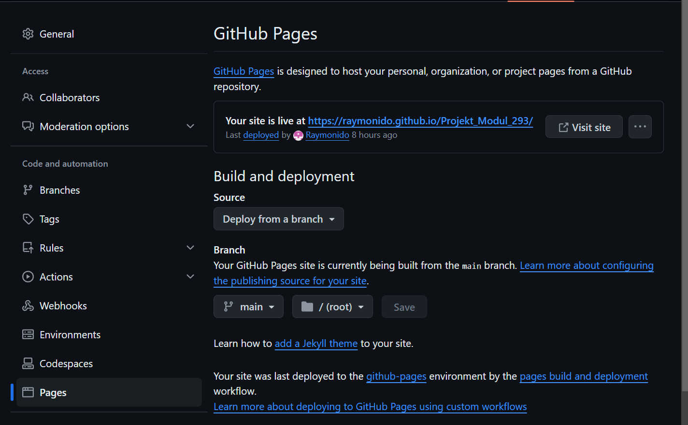

# Webauftritt veröffentlichen

## Ausgangslage

- Vor diesem Modul habe ich schonmal eine Webseite mithilfe von GitHub Pages publiziert.
- In der Aprentas haben wir ausserdem die Webseite mithilfe einer Domain des Lehrers veröffentlicht.
- Selber habe ich noch nie eine Domain gekauft

## Kompetenz E9

Ich kann damit diesen Kompetenzbereich erklären, dass ich meine aktuelle Webseite auf Github Pages veröffentlicht habe. Diese ist unter https://raymonido.github.io/Projekt_Modul_293/index.html zu finden. Nun kann ich mit diesem Link meine Webseite von allen geräten abrufen. 

## Wie macht man eine GitHub Pages Seite?

Zuerst geht man auf das gewünschte Repository, welches man öffentlich stellen möchte. Dabei muss man beachten, dass das Repository öffentlich sein muss, ansonsten geht es nicht. Danach geht man unter **Settings -> Pages**. So sollte dann die Seite aussehen:

Nun kann man unter **Build and deployment** den Branch auswählen, welcher als Seite angezeigt werden soll. Dies ist in unserem Fall sehr einfach, da ich meine Änderungen direkt auf den Main-Branch gepusht habe. Ansonsten ist es zu empfehlen, immer einen Feature Branch zu machen, wenn man Änderungen an der Webseite vornimmt, sodass man diesen später auf den Main-Branch mergen kann. Nun kann es etwas dauern, bis die Webseite live ist. Änderungen müssen nicht manuell bestätigt werden, sofern man alle Änderungen auf den Main Branch pusht. Dies geht sehr schnell.

## Selbsteinschätzung

Ich finde, ich habe in diesem Kompetenzbereich auch die erweiterten Kompetenzen erreicht. Dies kann ich damit erklären, dass ich meine Webseite auf GitHub Pages veröffentlichen konnte.

