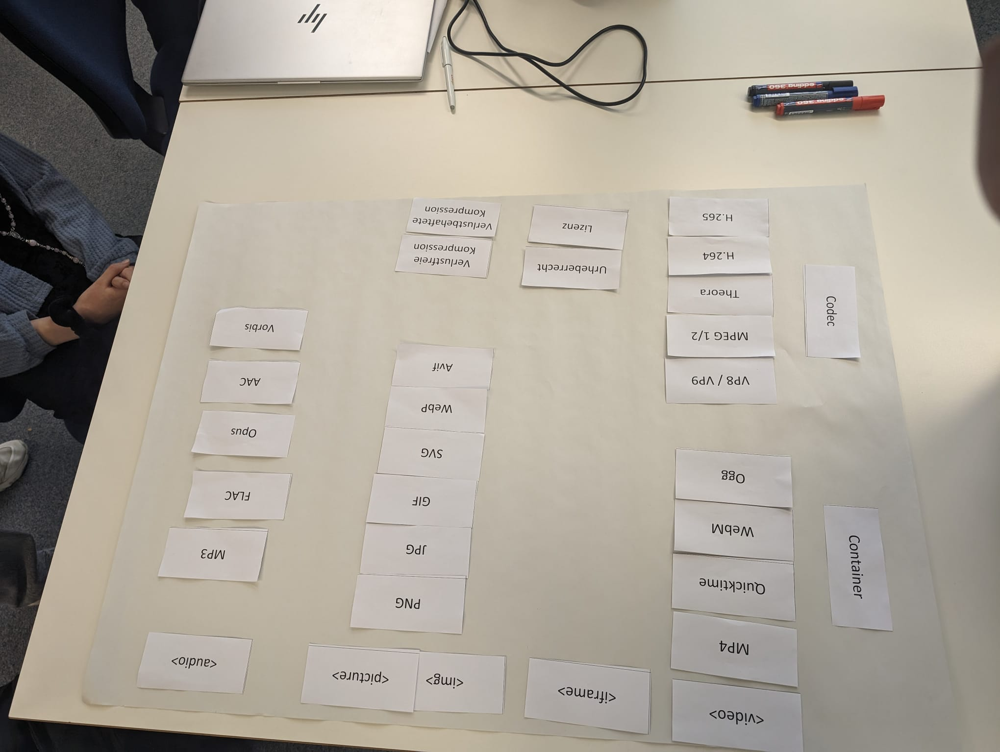
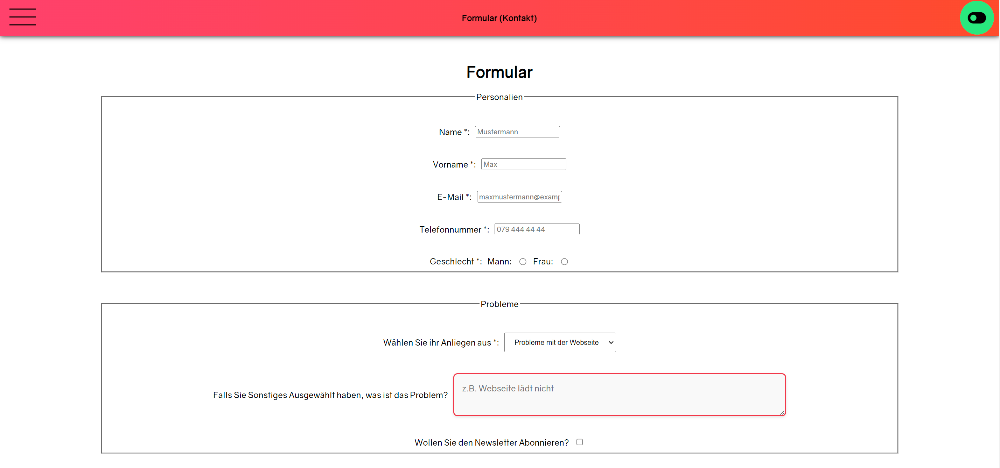

# Webseite aufbauen, Formulare anwenden, Medien einsetzen

## Ausgangslage

- Ich habe schon in der Aprentas Medien in Webseiten verwendet, da dies ein Kriterium war, um die Webseite zu erstellen.

- Auch in der Freizeit habe ich schon viel mit Dateiformaten gemacht. Da ich viel Videos schneide und diese auch editiere, habe ich verschiedenste Formate von Videos kennengelernt und in welchem Codec diese Komprimiert werden.

- Formulare habe ich auch in der Aprentas schonmal verwendet, jedoch habe ich seither nicht mehr viel mit Formularen gearbeitet, daher ist es für mich sicher gut, nochmals einen Einstieg in die Formulare zu machen. 

- Im Geschäft habe ich bereits das UI Design mithilfe des Programms "Moqups" geplant. Dies hat mir sehr geholfen und werde eine ähnliche Planung auch in diesem Projekt verwenden. ICh habe also schon etwas Erfahrung mit der Planung von einer Webseite.


## Dateiformate

Auf dem folgenden Bild sieht man eine geordnete Liste von den wichtigsten Dateiformaten. Diese wurde im Unterricht vom 17.05.2024 erstellt. Dabei wurde uns klar gemacht von Herrn Brodbeck, wie wichtig es ist, die richtigen Dateiformate in einer Webseite zu verwenden, da man sich bei verschiedenen Dateiformaten auf Kompression einlassen muss.



## Kompetenz E3

Mein Ziel am Anfang des Moduls war es, eine visuell ansprechende Seite zu erstellen, welche aus mehreren Seiten besteht. Daher war es für mich ziemlich klar, dass ich die E Kompetenz erreicht habe. 

### Wie habe ich meine Webseite geplant?

Zuerst habe ich mir Gedanken gemacht, was für eine Webseite ich überhaupt kreieren möchte. Da ich ja bereits schon ein paar andere Webseiten-Projekte am laufen habe, war ich mir nicht ganz sicher, ob ich an einer dieser Webseiten weiterarbeiten sollte. Ich habe mich dann letzendlich dafür entschieden, eine neue Webseite zu erstellen, bei welcher ich mich selber etwas besser vorstelle. Die Webseite sollte aus purem HTML, CSS und Javascript bestehen. Das wichtigste für mich an dieser Webseite war es, eine funktionierende und visuell ansprechende Webseite gestalten, welche etwas aus der Reihe tanzt. 


## Kompetenz E4

Ich habe in meiner Webseite ausserdem ein Formular eingebaut, um diese Kompetenzstufe zu erreichen. Dabei war es ausserdem mein Ziel, einen Service zu benutzen, mit welchem ich auch eine Mail bekomme, sobald jemand das Formular ausfüllt.

## Kompetenz E5

In meiner Webseite gibt es ein Formular, welches so aussieht:
```
 <div class="form">
            <form  
            action="https://formspree.io/f/myyrvvae"
            method="POST">
        
                <fieldset>
                    <legend>Personalien</legend>
                    <div class="input-field">
                        <label for="name">Name *:</label>
                        <input type="text" name="name" id="name" required placeholder="Mustermann">
                    </div>
                    <div class="input-field">
                        <label for="vorname">Vorname *:</label>
                        <input type="text" name="vorname" id="vorname" required placeholder="Max">
                    </div>
                    <div class="input-field">
                      <label for="email">E-Mail *:</label>
                      <input type="email" name="email" id="email" required placeholder="maxmustermann@example.com">
                  </div>
                  <div class="input-field">
                    <label for="tel">Telefonnummer *:</label>
                    <input type="tel" name="tel" id="tel" required placeholder="079 444 44 44">
                </div>
        
                    <div class="input-field">    
                        <label for="gender">Geschlecht *:</label>
                        <label for="gender">Mann:</label>
                        <input type="radio" name="gender" value="Mann" id="man">
                        <label for="woman">Frau:</label>
                        <input type="radio" name="gender" value="Woman" id="woman">
                    </div>
                    
                </fieldset>
                <fieldset>
                    <legend>Probleme</legend>
                    <div class="input-field">
                      <label for="problem">Wählen Sie ihr Anliegen aus *:</label>
                      <select id="problem" name="problem" required>
                      <option value="Problems with webpage">Probleme mit der Webseite</option>
                      <option value="Problem with service">Probleme mit dem Service</option>
                      <option value="Header blocks screen">Header blockiert den Screen</option>
                      <option value="Other">Sonstiges...</option>
                      </select>
                    </div>
                    <div class="input-field">
                      <label for="problem-other">Falls Sie Sonstiges Ausgewählt haben, was ist das Problem?</label>
                      <textarea name="problem-other" placeholder="z.B. Webseite lädt nicht"></textarea>
                    </div>
                    <div class="input-field">
                      <label for="Newsletter on">Wollen Sie den Newsletter Abonnieren?</label>
                        <input type="checkbox" name="Newsletter on">
                    </div>
                </fieldset>
                <div class="submit">
                    <input type="reset" value="Löschen" class="submit-button">
                    <input type="submit" value="Übermitteln" class="submit-button">
                </div>
        
            </form>
          </div>
```
In der Webseite sieht dann dieses Formular so aus: 




Man muss natürlich dazu sagen, dass CSS das Design des Formulars bestimmt, hier geht es mir einfach darum, zu zeigen wie mein Formular von der Struktur aussieht. 
## Was habe ich in diesem Kompetenzbereich gelernt?

Ich habe in diesem Kompetenzbereich vor allem gelernt, wie ich ein Formular mache, welches mir wirklich eine E-Mail sendet. Der Service von Formspree ist wirklich sehr einfach und sehr hilfreich, daher kann ich ihn sicher auch in zukünftigen Projekten verwenden. Ausserdem habe ich gelernt, welche Dateiformate es alles gibt und wie man sie richtig in einer Webseite einbindet. Ich habe mir dazu noch gedanken gemacht, wie man überhaupt die Medien ansprechend auf der Webseite gestalten kann. Diese überlegungen habe ich auch an meiner eigenen Webseite so gut wie nur möglich umgesetzt. Ich habe nämlich probiert, die Medien so flüssig wie möglich einzubinden.

## Selbsteinschätzung

Ich möchte auch in diesem Kompetenzbereich die Kompetenzstufe E erreichen. Dies kann ich anhand meiner Webseite beweisen, da Sie aus mehreren Seiten besteht. Ausserdem habe ich verschiedenste Medien verwendet, welche ich auch bewusst in meiner Webseite platziert habe. Als letztes habe ich ein funktionierendes Formular in meiner Webseite eingebaut, welches verschiedenste Elemente verwendet. Als letztes habe ich meinen Webauftritt konkret geplant. 