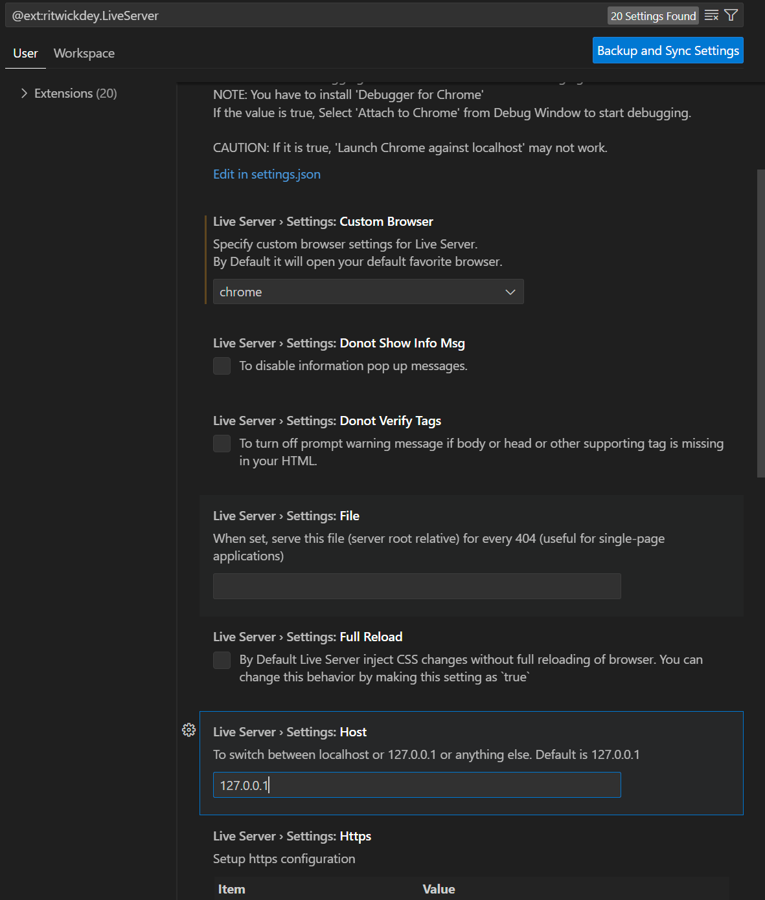
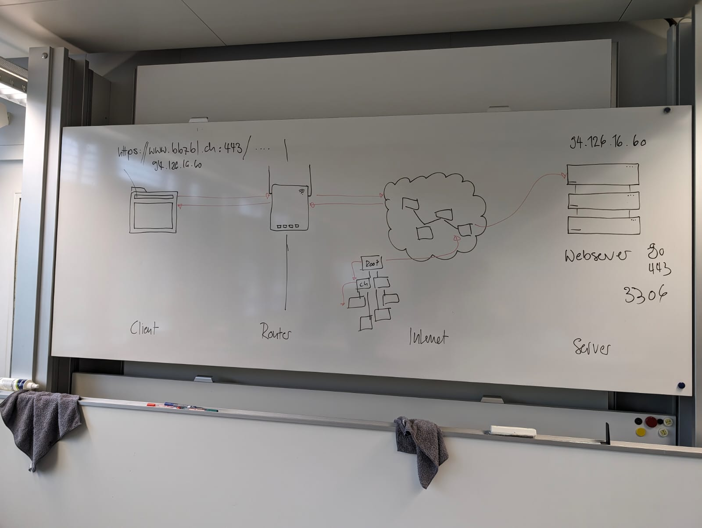
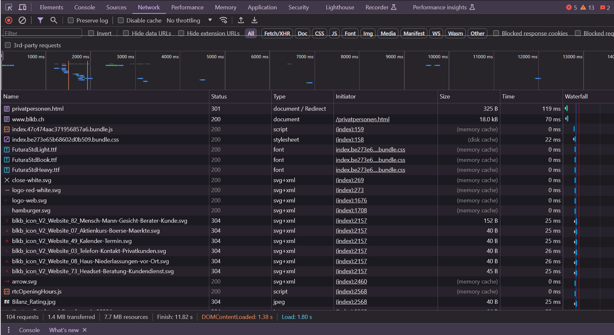

# Werkzeugunterstützung, HTTP-Protokoll
<br>

## Ausgangslage:

- Vor der Lehre hatte ich noch keine Ahnung über irgendwelche Tools im Browser, mit welchen man die Webseite analysieren kann.

- Die grundlagen, wie eine Webseite aufgebaut ist und welche Tools es in der Webentwicklung gibt habe ich in der Aprentas gelernt.

- Gerade vor kurzem habe ich im Geschäft mit der Webentwicklung angefangen und arbeite dort mit dem Framework Angular und bin auch aktiv an einem Projekt dran.

# Kompetenzzuwachs

## Kompetenz E1
In dieser Kompetenz zeige ich, wie ich meine Entwicklungsumgebung (VS Code) an meine eigenen Bedürfnisse anpassen kann. Dies mache ich wie folgt:

- Ich habe das Plugin "Remote Repository" heruntergeladen damit ich auf meein Projekt auf GitHub hochladen und speichern kann. So kann ich dieses Projekt auch mit Herrn Brodbeck teilen.

- Ausserdem habe ich den Live-Server so konfiguriert, dass immer Chrome geöffnet wird. Ich hätte ausserdem den Port ändern können, auf welchem der Live-Server geöffnet wird.

- Ich kann auch meine Entwicklungsumgebung farblich an meine Bedürfnisse anpassen, dies mache ich über "File -> Preferences -> Theme -> Color Theme" in Visual Studio Code.

- Für meine Angular Projekte habe ich ausserdem den "Angular Language Service" heruntergeladen, um mir die Arbeit mit Angular etwas zu vereinfachen.



## Kompetenz E2

## Wie funktioniert eine Anfrage an eine Webseite?


Auf dem Bild sieht man verschiedene Schritte, folgende 
<br>
Bei der Webseite meines Lehrbetriebs (www.blkb.ch) werden folgende daten geladen: 



Diese Dateien kann man unter dem "Network" Tab der Entwicklertools in Chrome einsehen. Diese Entwicklertools kann man aufrufen, indem man einen Rechtsklick auf die Seite macht und anschliessend auf "Untersuchen" klickt.


## GET und POST

<br>
GET und POST sind zwei häufig verwendete Methoden für HTTP-Anfragen, die im Rahmen der Kommunikation zwischen Webclients (wie Browsern) und Servern verwendet werden.


### GET

GET-Anfragen werden verwendet, um Daten von einem Server abzurufen. Get Anfragen sind nicht unbedingt sicher, daher sind Sie für das Anfragen von z.B. Passwörtern nicht geeignet. Dies ist daher nicht sicher, da die Anfrage in der URL mitgesendet wird. Eine Get Anfrage könnte so aussehen:
```
https://www.beispiel.com/suche?query=katzenbilder
```
Get Anfragen sind Cache-Fähig und sind damit sehr leistungsfähig.
<br>
### POST

Post-Anfragen werden verwendet um Daten auf den Server zu senden. Sie werden im Gegenteil zu den GET-Anfragen im Body der Anfrage versendet. Eine Post-Anfrage könnte so aussehen:

- Ein Nutzer füllt ein Registrierungsformular auf einer Webseite aus und klickt auf "Registrieren". Die Daten des Formulars (wie Name, E-Mail-Adresse und Passwort) werden in der POST-Anfrage zum Server gesendet.

Post-Anfragen werden also hauptsächlich verwendet, um Formulare oder Dateien auf den Server hochzuladen. Auch zum Aktualisieren von ressourcen werden Post-Anfragen verwendet, wenn z.B. ein Nutzer seine angegebenen Daten aktualisieren möchte und seine Logindaten ändert.
<br>
## Was sind Cookies?

Cookies sind Datenstücke, welche von Webseiten verwendet werden um Besucherdaten (Aktivität, Interaktionen auf der Webseite etc.) zu speichern. <br> 
Cookies sind sehr hilfreich um z.B. Interaktionen von Besuchern mit der Webseite zu speichern. Aus diesen Aktivitäten kann man dann die Benutzererfahrung verbessern oder Analysen erstellen, wie beliebt z.B. ein Feature der Webseite ist. Auch zur Personalisierung der Webseite sind Cookies hilfreich.
<br>
Es gibt verschiedene Arten von Cookies, welche alle zu unterschiedlichen Zwecken verwendet werden:

1. Session-Cookies: Diese Cookies werden Temporär (in der aktuellen Sitzung) erstellt. Diese Cookies sind z.B. nützlich um die gespeicherten in einem Warenkorb zu sichern und den Benutzer darauf hinzuweisen, dass er noch Artikel in seinem Warenkorb hat.

2. Persistente-Cookies: Diese Cookies bleiben für eine Bestimmte Zeit auf dem gerät des Besuchers gespeichert, damit diese Daten auch nach dem schliessen des Browsers noch bestehen bleiben.

3. Erstanbieter-Cookies: Diese werden direkt von der besuchten Website gesetzt und können nur von dieser Website gelesen werden.

4. Drittanbieter-Cookies: Diese Cookies werden von Drittanbietern verwendet, welche auf der Webseite vertreten sind. Diese Cookies werden vor allem für Werbezwecke odedr Verhaltenszwecke verwendet.
<br><br>


# Selbsteinschätzung

Ich finde ich kann sicher die E Kompetenzen dieses Kompetenzbereiches erfüllen, da ich das Prinzip vertanden habe, wie Webseiten aufgebaut sind und wie Sie sich verhalten im Internet. Auch die wichtigsten HTML-Tags sind mir schon bekannt und der Prozess zur Abfrage einer Webseite ist mir bekannt. Auch meine Entwicklungsumgebung kann ich an meine eigenen Bedürfnisse anpassen, dabei kann ich verschiedenste Plugins installieren um z.B. mein Projekt auf GitHub hochzuladen. 
Ich finde ich kann sicher die F Kompetenzen dieses Kompetenzbereiches erfüllen, da ich das Prinzip vertanden habe, wie Webseiten aufgebaut sind und wie Sie sich verhalten im Internet. Auch die wichtigsten HTML-Tags sind mir schon bekannt und der Prozess zur Abfrage einer Webseite ist mir bekannt. 

## Feedback
Ich kann Ihre Kompetenzentwicklung anhand der Ressourcen gut nachvollziehen.
Achten Sie darauf, dass Sie die Ausgangslage nur für den jeweiligen Kompetenzbereich  schreiben.
